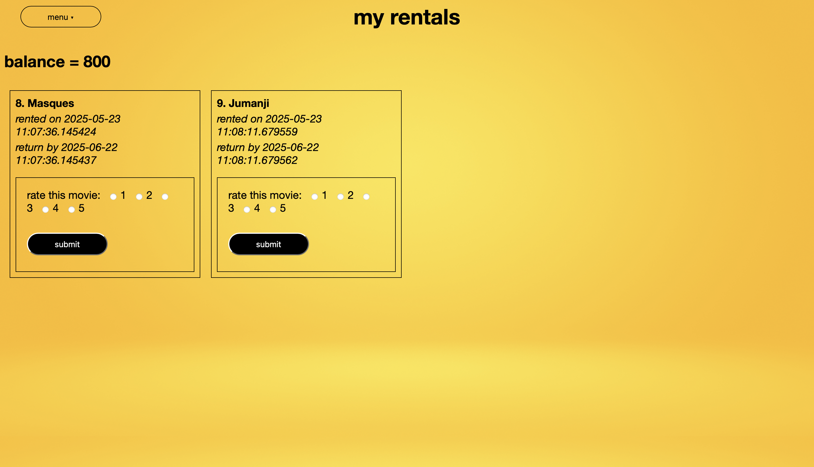

# movie-rental-system


as the title suggests, this is a web application for managing movie rentals, with support for user, staff, and manager roles, and email notifications. there is also a recommender model.

### features include:
- user authentication (signup, login, logout)
- browse, search, and rent movies
- email notifications and receipt generation
- role based access (user, staff, and manager)

### tech-stack used:
- __backend:__ python and flask
- __frontend:__ html and css (occasionally bootstrap)
- __database:__ sqlite
- __email:__ smtp

### screenshots:

#### 1. login page

#### 2. create account page

#### 3. home page

#### 4. view page

#### 5. rentals page

#### 6. staff login page

#### 7. manager login page


### setup instructions:

#### 1. clone the repo
```
git clone https://github.com/rthponder/movie-rental-system.git
cd movie-rental-system
```

#### 2. create and activate a virtual environment
```
python -m venv venv
source venv/bin/activate
```

#### 3. install dependencies
```
pip install -r requirements.txt
```

#### 4. configure environment variables
create a `.env` file in the root dierectory to store sensitive information such as email credentials, secret key, etc.

#### 5. run the application
```
python app.py
```

###### _this project wouldn't have been possible without the help of [parthiv](https://github.com/blip100), my senior at college. so thanks to him._
###### _i'm grateful to [sublime text](https://www.sublimetext.com/3) and eveyone who contributes to it in a meaningful way. they make my life much easier and pleasant._

